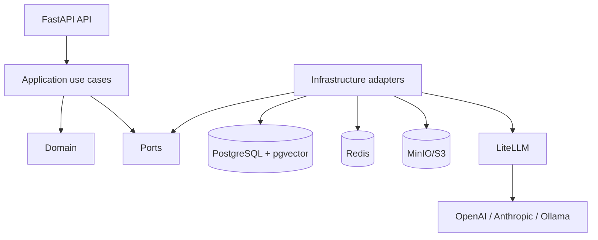
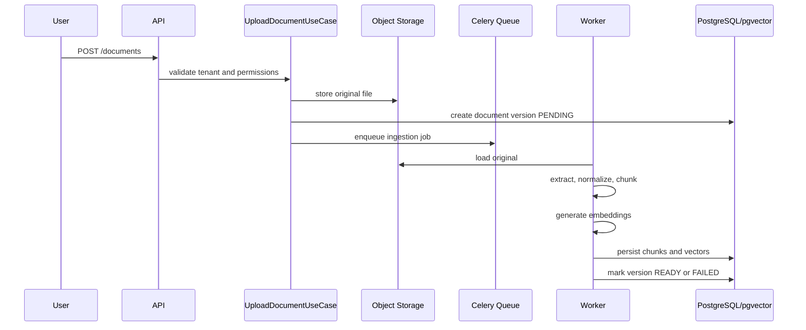
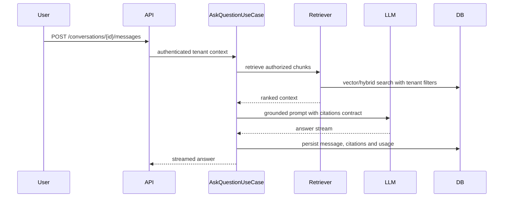

# Architecture

## Estilo arquitectonico

DocBrain adopta un monolito modular. La prioridad es mantener bajo el coste
operacional mientras se preservan limites internos claros entre dominio,
aplicacion e infraestructura.

Cada modulo expone casos de uso y modelos propios. Los endpoints FastAPI solo
validan entrada, resuelven dependencias y delegan en casos de uso.

## Capas

- `api`: routers, schemas HTTP, dependencias y manejo de errores.
- `application`: casos de uso, DTOs internos y transacciones.
- `domain`: entidades, value objects, politicas y errores de negocio.
- `infrastructure`: SQLAlchemy, LiteLLM, Redis, Celery, MinIO/S3 y pgvector.
- `observability`: logging, tracing, metricas y correlacion de requests.

## Dependencias

La capa de dominio no depende de FastAPI, SQLAlchemy, Celery ni proveedores LLM.

## Flujo de ingestion

## Flujo de consulta

## Multi-tenancy

El `organization_id` es obligatorio en entidades de negocio compartidas. Todos
los casos de uso reciben un `TenantContext` con usuario, organizacion, roles y
correlation id.

Las consultas a datos tenant-scoped deben filtrar por `organization_id`. Las
politicas de dominio validan membresia y rol antes de ejecutar acciones
sensibles. Los tests de integracion deben cubrir intentos de acceso cruzado
entre organizaciones.

## Jobs asincronos

Celery se usa para ingestion porque la extraccion, chunking y embeddings pueden
ser lentos y reintentables. Cada job debe ser idempotente por
`document_version_id`; un reintento no debe duplicar chunks activos.

Estados de ingestion:

- `pending`
- `extracting`
- `chunking`
- `embedding`
- `ready`
- `failed`

## Observabilidad

Cada request y job debe incluir `correlation_id`, `organization_id`,
`user_id` cuando aplique y `document_id` o `conversation_id` cuando exista.

Metricas minimas:

- Latencia HTTP por endpoint.
- Duracion de ingestion por fase.
- Numero de chunks por documento.
- Latencia de retrieval y generacion.
- Tokens de entrada/salida.
- Errores por proveedor LLM.
- Consultas sin evidencia suficiente.

## Principales tradeoffs

- Monolito modular frente a microservicios: menor complejidad inicial y mejor
  velocidad de desarrollo, con limites internos verificables por tests.
- pgvector frente a vector database dedicada: menos piezas operacionales para
  el MVP y suficiente para demostrar retrieval, filtros y evaluacion.
- LiteLLM frente a SDKs directos: permite cambiar proveedor y registrar costes
  sin acoplar los casos de uso al modelo concreto.
- Celery frente a background tasks de FastAPI: mejor control de reintentos,
  workers y observabilidad de jobs largos.

